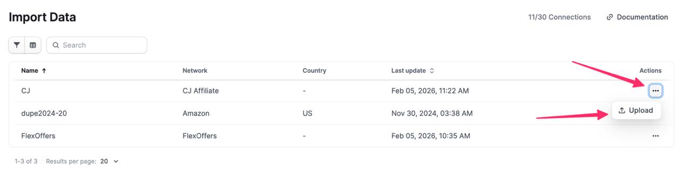
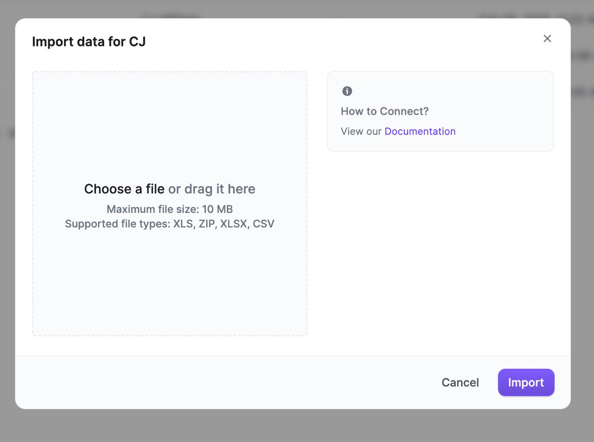

# Strackr UI Guide for CJ Click Data Import

**Visual guide showing the exact Strackr interface for importing CJ Affiliate click statistics.**

## Step-by-Step Visual Workflow

### Step 1: Navigate to Import Data Page

**URL:** https://app.strackr.com/connections/importdata

You'll see a table showing your network connections:

**Key elements visible:**
- **"Import Data" heading** at top left
- **Connections table** with columns: Name, Network, Country, Last update, Actions
- **CJ row** showing:
  - Name: "CJ"
  - Network: "CJ Affiliate"  
  - Last update timestamp
  - **"Upload" button** in Actions column (highlighted with pink arrow)

### Step 2: Click Upload Button

Click the **"Upload" button** in the Actions column for the CJ row (indicated by the pink arrow in screenshot).

### Step 3: Upload Modal Dialog

After clicking Upload, you'll see this modal:

**Modal elements:**
- **Title:** "Import data for CJ"
- **Help section:** "How to Connect?" with link to Documentation
- **File upload area:** Large drag-and-drop zone saying "Choose a file or drag it here"
- **File restrictions:** 
  - Maximum file size: 10 MB
  - Supported file types: XLS, ZIP, XLSX, CSV
- **Action buttons:** "Cancel" (gray) and "Import" (purple)

### Step 4: Complete the Upload

1. **Select your CSV file** by clicking the upload area or dragging the file
2. **Choose the CJ performance report CSV** exported from CJ Affiliate
3. **Click the "Import" button** (purple button) to start the import process
4. **Wait for confirmation** that the import completed successfully

## File Requirements

Based on the modal specifications:
- ✅ **CSV format** (our CJ exports are CSV)
- ✅ **Under 10MB** (performance reports are typically small)
- ✅ **Supported format** (CSV is explicitly listed)

## Expected CSV Files

The automation will upload these files exported from CJ Affiliate:
- `performance_by_advertiser_by_website_[date-range]_daily.csv`

## Troubleshooting

If you don't see the CJ row in the connections table:
1. Verify your Strackr account has CJ Affiliate configured
2. Check that you have the correct account permissions
3. Ensure you're logged into the right Strackr account

If the upload modal doesn't appear:
1. Make sure you're clicking the correct "Upload" button (in the CJ row)
2. Check for browser popup blockers
3. Try refreshing the page and repeating the process

## Account Requirements

From the screenshots, this workflow requires:
- **Strackr account type:** "Member" with full access
- **CJ integration:** Must be already connected/configured
- **Proper permissions:** Upload/import capabilities enabled

---

*Screenshots provided by Ramin B. showing the exact Strackr UI workflow - captured February 5, 2026*